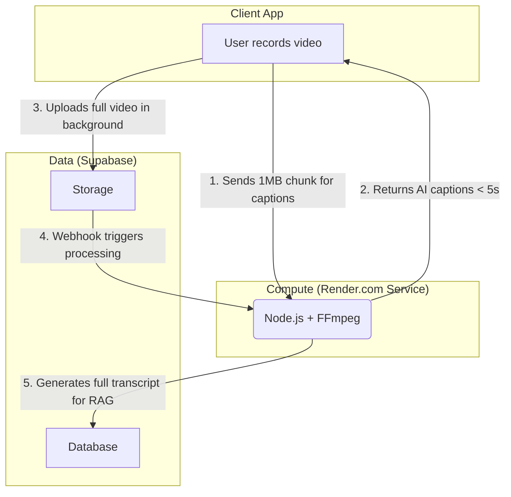

# 🧇 Wednesday Waffle

> A tiny, private "Snap-clone lite" for friend groups who no longer share the same city.

**Wednesday Waffle** recreates the feeling of "hanging out in the kitchen" through a simple weekly ritual: every Wednesday, friends drop quick video updates. No performative posting, no algorithms—just authentic moments shared with your closest people.

## 🎯 The Problem We're Solving

- **Public socials feel too performative** → endless audience pressure
- **Group chats are text-heavy** → lack visual connection
- **Friends drift apart across cities** → need low-pressure ritual to stay close

**Wednesday Waffle splits the difference**: a lightweight, semi-synchronous space to swap real-life snippets without performing for the internet.

## ✨ Core Features

### 📱 **Capture & Share**
- Record ≤5min videos with built-in camera
- Auto-downscaled to 720p for optimal performance

### 👥 **Private Groups**
- Create or join groups via magic invite codes
- Perfect for 3-10 friends living in different cities
- Real-time updates via Supabase Realtime

### 🔔 **Wednesday Nudger**
- Smart push notifications (9AM & 8PM local time)
- Gentle reminders if you haven't posted your waffle
- Fully customizable in settings

### 🤖 **AI-Powered Features**
- **Prompt-Me-Please**: Smart conversation starters when camera is idle >10s
- **Caption Genie**: Three AI-generated captions (≤70 chars) in <3s
- **Catch-Up Recap**: 80-word TL;DR overlay for quick context

## 🛠 Tech Stack

- **Frontend**: React Native + Expo Router, StyleSheet API, Zustand
- **Backend**: Hybrid model
    - **Data Plane**: Supabase (Auth, Postgres, Storage, Realtime)
    - **Compute Plane**: Render.com (Node.js + FFmpeg) for AI/media processing
- **AI**: Render Service → FFmpeg → Whisper TTS → GPT-4o
- **Performance**: All AI calls return in <3s (SnapConnect success metric)

## 🚀 Current Implementation Status

### ✅ **Completed**
- [x] React Native + Expo foundation with tab navigation
- [x] Camera functionality with video recording (5min max)
- [x] Group management (create/join with invite codes)
- [x] Zustand state management with proper TypeScript interfaces
- [x] Polished UI with Inter/Poppins fonts and consistent design
- [x] Message components with reactions, likes, and retention types
- [x] **Supabase backend integration** (Auth, Database, Storage)
- [x] **Real-time messaging and group updates**
- [x] **Video/photo upload to Supabase Storage**
- [x] **Complete database schema with RLS policies**
- [x] **Google OAuth authentication**
- [x] **User profile management**
- [x] **Multi-group video sharing**
- [x] **Retention types** (view-once, 7-day, keep-forever)

### 🔄 **In Progress**
- [ ] AI features implementation (Prompt-Me-Please, Caption Genie, Catch-Up Recap)
- [x] Push notification system → **Wednesday Nudge local notifications**
- [ ] RAG infrastructure with vector embeddings

### 🎯 **User Stories (MVP)**
1. **US-1**: Capture & post waffle *(UI complete, backend integration needed)*
2. **US-2**: Wednesday nudger push notifications
3. **US-3**: Prompt-me-please AI suggestions
4. **US-4**: Caption Genie AI captions
5. **US-5**: Catch-up recap AI summaries 
6. **US-6**: Share across multiple groups 

## 📁 Project Structure

```
wednesday-waffle/
├── app/                          # Expo Router pages
│   ├── (tabs)/                  # Tab navigation screens
│   │   ├── index.tsx            # Chat/Groups list
│   │   ├── camera.tsx           # Video/photo capture
│   │   └── profile.tsx          # User settings
│   ├── auth/callback.tsx        # OAuth callback handler
│   ├── chat/[groupId].tsx       # Individual group chat
│   ├── group-details/[groupId].tsx # Group settings
│   ├── group-selection.tsx      # Multi-group sharing
│   └── _layout.tsx              # Root navigation
├── components/                  # Reusable UI components
│   ├── Auth.tsx                 # Authentication UI
│   ├── GroupCard.tsx            # Group preview cards
│   ├── ProfileSetup.tsx         # User onboarding
│   ├── WaffleCard.tsx           # Message cards
│   ├── WaffleMessage.tsx        # Message display component
│   └── WednesdayNudge.tsx       # Notification modal
├── hooks/                       # Custom React hooks
│   ├── useAuth.ts               # Authentication logic
│   ├── useMedia.ts              # Camera & upload utilities
│   └── useRealtime.ts           # Real-time subscriptions
├── lib/                         # Backend services
│   ├── supabase.ts              # Supabase client setup
│   ├── database-service.ts      # CRUD operations
│   ├── storage-service.ts       # File upload/download
│   ├── profile-service.ts       # User management
│   └── settings-service.ts      # App preferences
├── render-backend/              # Node.js backend for AI processing
│   └── ...
├── store/                       # Zustand state management
│   └── useWaffleStore.ts        # Main app state
├── render.yaml                  # Infrastructure-as-Code for Render.com
└── scripts/supabase/            # Database migrations
    ├── 01-profiles-table.sql    # User profiles
    ├── 02-groups-table.sql      # Groups & invite codes
    ├── 03-group-members-table.sql # Memberships
    ├── 04-waffles-table.sql     # Messages/waffles
    └── ...                      # 11+ migration files
```

## 🏗 Installation & Setup

### Prerequisites
- Node.js 18+
- Expo CLI (`npm install -g @expo/cli`)
- iOS Simulator / Android Emulator or physical device

### Quick Start

```bash
# Clone the repository
git clone <your-repo-url>
cd wednesday-waffle

# Install dependencies
npm install

# Start development server
npm run dev

# Run on iOS/Android
# Follow Expo CLI prompts or scan QR code with Expo Go app
```

### Environment Setup (Required)
```bash
# Create .env.local file
EXPO_PUBLIC_SUPABASE_URL=your-supabase-url
EXPO_PUBLIC_SUPABASE_ANON_KEY=your-supabase-anon-key
EXPO_PUBLIC_OPENAI_API_KEY=your-openai-key  # For future AI features
EXPO_PUBLIC_CAPTION_SERVICE_URL=captions-route-for-render-backend # Needed to host on render because Supabase functions do not support using things liuke ffmpeg
```

## 🎨 Design Philosophy

- **Authentic over performative**: Real moments, not highlight reels
- **Simple over complex**: One action per Wednesday, no endless scrolling
- **Private over public**: Your closest friends, not the whole internet


## 🗂 Database Schema (Implemented)

```sql
-- Profiles table (extends auth.users)
profiles (
  id, name, avatar_url, created_at, updated_at,
  -- Notification fields (to be added):
  notifications_enabled, notification_permission_requested, last_waffle_week
)

-- Groups table  
groups (id, name, invite_code, created_at)

-- Group memberships
group_members (group_id, user_id, joined_at)

-- Waffles (messages)
waffles (id, user_id, group_id, content_url, caption, retention_type, created_at, expires_at)

-- Transcripts for RAG
transcripts (id, waffle_id, text, embedding, created_at, ai_recap)

-- AI prompt feedback
prompts_feedback (id, prompt_text, user_reaction, created_at)
```

## 🤖 AI Features Architecture



## 📝 Development Notes

- **Built from scratch using Bolt.new** - rapid prototyping to current state
- **Performance target**: All AI endpoints must respond in <3 seconds
- **Production backend**: Supabase with complete database schema and RLS policies
- **Real-time ready**: Live messaging and group updates via Supabase Realtime
- **Demo-ready**: Core features fully functional for walkthrough
- **Mobile-first**: Optimized for iOS/Android with web support

## 🎯 Success Metrics

- **Feature completeness**: ✅ Core messaging & groups implemented (~70% complete)
- **Performance**: AI endpoints P95 latency <3s (pending implementation)
- **Demo**: ✅ Core features stable for walkthrough
- **Bonus**: ✅ Multi-group sharing delivered

## 🚧 Next Steps

1. **Wednesday Nudge System**: Complete local notification implementation
2. **AI Implementation**: Build Edge Functions for STT and RAG
3. **Testing & Polish**: Ensure <3s AI response times
4. **Demo Preparation**: Record walkthrough video
5. **Performance Optimization**: Fine-tune real-time features

## 🤝 Contributing

This is currently a solo project built for a specific use case, but open to feedback and suggestions!

## 📄 License

Private project - All rights reserved.

## 🔔 Wednesday Nudge System (In Development)

### **Implementation Approach: Local Notifications**
We chose local notifications over push notifications for simplicity and reliability:
- No backend infrastructure required
- Works offline
- Respects user's timezone automatically
- Perfect for predictable, calendar-based reminders

### **Notification Schedule**
- **When**: Every Wednesday at 9AM and 8PM local time
- **Who**: Users who haven't posted a waffle that calendar week
- **Messages**:
  - 9AM: "Time to share your Wednesday waffle! 🧇"
  - 8PM: "Don't let Wednesday slip away! Share your waffle 🧇"

### **Smart Behavior**
- Automatically cancelled when user posts a waffle
- Calendar week based (Sunday-Saturday)
- One post to any group counts for the week
- Simple on/off toggle in settings
- Opt-out by default (notifications enabled unless user disables)

### **Technical Details**
- Uses `expo-notifications` for local scheduling
- Schedules up to 4 weeks in advance (iOS limit: 64 notifications)
- Reschedules on every app launch to maintain coverage
- Permission requested during profile setup

---

**Wednesday Waffle** - Because staying connected shouldn't feel like work. 🧇✨
