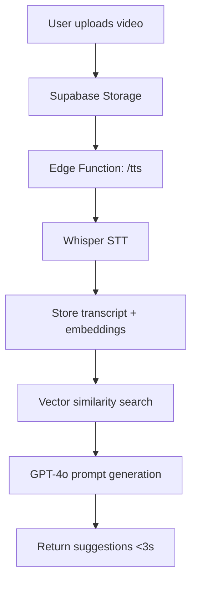

# 🧇 Wednesday Waffle

> A tiny, private "Snap-clone lite" for friend groups who no longer share the same city.

**Wednesday Waffle** recreates the feeling of "hanging out in the kitchen" through a simple weekly ritual: every Wednesday, friends drop quick video or photo updates that stay in the group thread for 7 days. No performative posting, no algorithms—just authentic moments shared with your closest people.

## 🎯 The Problem We're Solving

- **Public socials feel too performative** → endless audience pressure
- **Group chats are text-heavy** → lack visual connection
- **Friends drift apart across cities** → need low-pressure ritual to stay close

**Wednesday Waffle splits the difference**: a lightweight, semi-synchronous space to swap real-life snippets without performing for the internet.

## ✨ Core Features

### 📱 **Capture & Share**
- Record ≤5min videos or snap photos with built-in camera
- Choose retention: **view-once** | **7 days** (default) | **keep forever** 
- Auto-downscaled to 720p for optimal performance

### 👥 **Private Groups**
- Create or join groups via magic invite codes
- Perfect for 3-10 friends living in different cities
- Real-time updates via Supabase Realtime

### 🔔 **Wednesday Nudger**
- Smart push notifications (9AM & 8PM local time)
- Gentle reminders if you haven't posted your waffle
- Fully customizable in settings

### 🤖 **AI-Powered Features**
- **Prompt-Me-Please**: Smart conversation starters when camera is idle >10s
- **Caption Genie**: Three AI-generated captions (≤70 chars) in <3s
- **Catch-Up Recap**: 80-word TL;DR overlay for quick context

## 🛠 Tech Stack

- **Frontend**: React Native + Expo Router, NativeWind, Zustand
- **Backend**: Supabase (Auth, Postgres, Storage, Realtime, Vector/pgvector)
- **AI**: Edge Functions → Whisper STT → Supabase Vector → GPT-4o
- **Performance**: All AI calls return in <3s (SnapConnect success metric)

## 🚀 Current Implementation Status

### ✅ **Completed**
- [x] React Native + Expo foundation with tab navigation
- [x] Camera functionality with video recording (5min max)
- [x] Group management (create/join with invite codes)
- [x] Zustand state management with proper TypeScript interfaces
- [x] Polished UI with Inter/Poppins fonts and consistent design
- [x] Message components with reactions, likes, and retention types
- [x] Mock data structure for groups, users, and messages

### 🔄 **In Progress**
- [ ] Supabase backend integration
- [ ] Real-time messaging and notifications
- [ ] Video/photo upload to Supabase Storage
- [ ] AI features implementation (Prompt-Me-Please, Caption Genie, Catch-Up Recap)
- [ ] Push notification system
- [ ] RAG infrastructure with vector embeddings

### 🎯 **User Stories (MVP)**
1. **US-1**: Capture & post waffle *(UI complete, backend integration needed)*
2. **US-2**: Wednesday nudger push notifications *(planned)*
3. **US-3**: Prompt-me-please AI suggestions *(planned)*  
4. **US-4**: Caption Genie AI captions *(planned)*
5. **US-5**: Catch-up recap AI summaries *(planned)*
6. **US-6**: Share across multiple groups *(stretch goal)*

## 📁 Project Structure

```
wednesday-waffle/
├── app/                     # Expo Router pages
│   ├── (tabs)/             # Tab navigation screens
│   │   ├── index.tsx       # Chat/Groups list
│   │   ├── camera.tsx      # Video/photo capture
│   │   ├── groups.tsx      # Group management
│   │   └── profile.tsx     # User settings
│   ├── chat/[groupId].tsx  # Individual group chat
│   └── _layout.tsx         # Root navigation
├── components/             # Reusable UI components
│   ├── WaffleCard.tsx      # Group preview cards
│   ├── WaffleMessage.tsx   # Message display component
│   └── WednesdayNudge.tsx  # Notification modal
├── store/                  # Zustand state management
│   └── useWaffleStore.ts   # Main app state
└── hooks/                  # Custom React hooks
```

## 🏗 Installation & Setup

### Prerequisites
- Node.js 18+
- Expo CLI (`npm install -g @expo/cli`)
- iOS Simulator / Android Emulator or physical device

### Quick Start

```bash
# Clone the repository
git clone <your-repo-url>
cd wednesday-waffle

# Install dependencies
npm install

# Start development server
npm run dev

# Run on iOS/Android
# Follow Expo CLI prompts or scan QR code with Expo Go app
```

### Environment Setup (Coming Soon)
```bash
# Create .env.local file
EXPO_PUBLIC_SUPABASE_URL=your-supabase-url
EXPO_PUBLIC_SUPABASE_ANON_KEY=your-supabase-anon-key
EXPO_PUBLIC_OPENAI_API_KEY=your-openai-key
```

## 🎨 Design Philosophy

- **Authentic over performative**: Real moments, not highlight reels
- **Simple over complex**: One action per Wednesday, no endless scrolling
- **Private over public**: Your closest friends, not the whole internet
- **Ephemeral by default**: Memories that naturally fade (unless you choose otherwise)

## 🗂 Database Schema (Planned)

```sql
-- Users table
users (id, name, email, avatar_url, created_at)

-- Groups table  
groups (id, name, invite_code, created_at)

-- Group memberships
group_members (group_id, user_id, joined_at)

-- Waffles (messages)
waffles (id, user_id, group_id, content_url, caption, retention_type, created_at, expires_at)

-- Transcripts for RAG
transcripts (id, waffle_id, text, embedding, created_at)

-- AI prompt feedback
prompts_feedback (id, prompt_text, user_reaction, created_at)
```

## 🤖 AI Features Architecture



## 📝 Development Notes

- **Built from scratch using Bolt.new** - rapid prototyping to current state
- **Performance target**: All AI endpoints must respond in <3 seconds
- **Demo-ready**: 5-minute walkthrough showcasing core features
- **Mobile-first**: Optimized for iOS/Android with web support

## 🎯 Success Metrics

- **Feature completeness**: 5-6 user stories pass manual QA
- **Performance**: AI endpoints P95 latency <3s
- **Demo**: No crashes during 5-minute walkthrough
- **Bonus**: Deliver stretch story (multi-group sharing)

## 🚧 Next Steps

1. **Supabase Integration**: Set up auth, database, and storage
2. **AI Implementation**: Build Edge Functions for STT and RAG
3. **Real-time Features**: Implement live messaging and notifications  
4. **Testing & Polish**: Ensure <3s AI response times
5. **Demo Preparation**: Record walkthrough video

## 🤝 Contributing

This is currently a solo project built for a specific use case, but open to feedback and suggestions!

## 📄 License

Private project - All rights reserved.

---

**Wednesday Waffle** - Because staying connected shouldn't feel like work. 🧇✨
